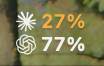

# Token Glance

Claude Code & Codex usage limits at a glance, in your macOS menu bar.

<!-- SCREENSHOT PLACEHOLDER: two-line menu bar label (C 62% / X 80%) and the details panel.
     Add as docs/images/menubar.png and replace this comment with:
      -->
*Screenshot coming soon.*

> **Status:** in development (M5). Build from source; no signed release yet.

Token Glance shows how much of the **5-hour session** and **weekly** limits you have left in
Claude Code and Codex CLI, as a two-line menu bar label:

```
[C] 62%
[X] 80%
```

Click it for details: per-window gauges with `N% used / M% left`, reset times with a live
countdown, and tokens used today and this week (input / output / cache, top models).

## Features

- Two-line label (one line when only one tool is enabled), orange at 30% left or less, red at 10%.
- Remaining % (default) or used %.
- Updates within seconds of new activity (FSEvents), reading only the bytes appended to logs.
- Shows why a value is missing (`--`): hook not installed, no data yet, data too old, …
- Settings: display mode, tools on/off, custom log folders, open at login, Claude hook install/repair/uninstall.
- Optional notifications (off by default) when the remaining percentage drops past 30% / 10%
  (configurable), and when a new window starts after running low.
- English and Korean, following the system language by default or chosen in settings.
- A 14-day history window with daily tokens per tool, from local logs.
- Optional Codex online limit checks through the installed Codex App Server (off by default).
- Optional Claude online limit checks through the installed Claude Code (off by default; uses an
  experimental, unofficial path — see Privacy and Limitations).

## How it gets the numbers

| | Limits (% and reset time) | Tokens |
|---|---|---|
| **Claude Code** | By default, Claude Code passes them only to **statusline commands**. A small hook records them and then runs your existing statusline (e.g. oh-my-claudecode's HUD) with the same input. With online checks enabled, a recent plan-limit answer from the installed Claude Code takes priority; failed checks fall back to the hook cache with a reason and last observation time. | `~/.claude/projects/**/*.jsonl` (respects `CLAUDE_CONFIG_DIR`); online answers never replace token totals. |
| **Codex CLI** | By default, `token_count` events in `~/.codex/sessions/**/rollout-*.jsonl` (respects `CODEX_HOME`). With online checks enabled, valid account limits from the installed Codex App Server take priority; failed checks fall back to local limits with a reason and last observation time. | Local rollout files only; online usage totals are not added. |

Details of the formats are in [docs/log-schemas.md](docs/log-schemas.md).

## Privacy

- **Online checks off (default):** no child processes, network requests or credential access; limits and token totals come from local files.
- **Claude online checks on:** after you consent in Settings, Token Glance starts the installed
  `claude` about every five minutes (and on Refresh, launch, wake and a Claude window reset) in headless
  mode with no prompt (`--safe-mode`, `--no-session-persistence`, telemetry off) and sends one
  `get_usage` control request. Claude Code uses its own login and requests the plan usage from
  Anthropic's servers through an undocumented endpoint. Token Glance never reads, stores or changes
  the token, the Keychain item or the credentials file; Claude Code itself may refresh its login as it
  normally does and keeps a short-lived usage snapshot in its own state. Only percentages and reset
  times are kept, in memory. Turning the option off cancels a running check.
- **Codex online checks on:** after you consent in Settings, Token Glance starts the installed Codex App Server as a child process. Codex uses your existing login and may make network requests for account limits. Token Glance does not directly read authentication files or Keychain. Limits refresh every five minutes or on manual refresh; update notifications are an additional signal.
- Prompt and response text is never stored, logged or sent. Only numbers (token counts,
  percentages, reset times, model names) are used, and only in memory.
- The hook writes just the limit values to
  `~/Library/Application Support/TokenGlance/claude-rate-limits.json`; no paths, session ids or names.
- Installing the hook changes one key (`statusLine.command`) in Claude Code's `settings.json`,
  only after you confirm, and only after backing up the whole file. Uninstall restores it.

## Install

Requires macOS 14+ and Swift 5.10+ (Xcode or the Command Line Tools).

```sh
git clone https://github.com/yim0327/token-glance.git
cd token-glance
./scripts/bundle-app.sh        # builds dist/TokenGlance.app (ad hoc signed)
open dist/TokenGlance.app
```

Then click the menu bar item, open **Settings…** and choose **Install…** under "Claude limits hook".
The same can be done from a terminal:

```sh
dist/TokenGlance.app/Contents/Resources/token-glance-hook install     # backs up settings.json first
~/Library/Application\ Support/TokenGlance/bin/token-glance-hook uninstall
```

### Opening an unsigned app

Token Glance is not notarized (no Apple Developer account). A locally built app usually opens
directly. If you downloaded a build and macOS refuses to open it, right-click the app and choose
**Open**, or remove the quarantine flag:

```sh
xattr -cr TokenGlance.app
```

"Open at login" uses `SMAppService`; for an unsigned app macOS may ask you to approve it in
System Settings › General › Login Items.

## Development

```sh
swift build
./scripts/test.sh     # `swift test`; also runs the tests when only the Command Line Tools are installed
dist/TokenGlance.app/Contents/MacOS/TokenGlance --print-state   # label and tooltip once, no UI
```

Design decisions: [docs/adr](docs/adr). Performance measurements: [docs/perf.md](docs/perf.md).

## Limitations

- Limits are percentages only; neither tool exposes remaining token counts for subscription plans.
- Claude limits update only while Claude Code runs (they arrive through the statusline). Values
  older than 7 days are hidden; a window whose reset time has passed shows as reset.
- Log formats are undocumented and may change. Unknown fields are ignored and unreadable lines skipped.
- Codex limit fields were verified on one machine with few sessions (see docs/log-schemas.md §2).
- Codex sessions idle for more than 24 hours and then resumed may update only with the 5-minute
  fallback poll.
- Notifications only react to new observations while the app is running; changes that happened
  while the Mac was asleep or the app was closed are not sent afterwards.
- The history chart counts only logs on this Mac. Days before the oldest log are shown as having
  no logs, not as zero usage.
- Codex online checks require an installed Codex version with the App Server rate-limit methods (verified in codex-cli 0.162.0). API-key logins do not provide ChatGPT subscription limits. Multiple limit buckets stay separate; missing values remain unavailable. Aside usage attribution to account limits is unverified.
- Local rollout logs do not carry a verified account identity. A fallback limit may belong to a different account; the app labels its source and never combines it with account-limit buckets.
- With online checks enabled, the App Server child can raise combined physical memory above the 50 MB target (59.7 MB average in one 5-minute measurement). See [performance notes](docs/perf.md).
- Claude online checks are **not an official, supported API**. They use Claude Code's experimental
  `get_usage` control request (verified on Claude Code 2.1.296), which reads an undocumented server
  endpoint; either can change or stop without notice, and then the hook cache is shown. Whether this
  use is allowed under the terms for your account is for you to check. API-key and cloud-provider
  logins have no plan limits. Scoped weekly meters (per model) are not shown. Each check briefly runs
  a `claude` process (about 0.3 s CPU and ~230 MB resident memory while it runs).

## Compared with similar tools

Other menu bar apps track AI coding usage (for example
[CodexBar](https://github.com/steipete/CodexBar)). Token Glance makes a narrower set of choices:

- Two tools only (Claude Code and Codex), both visible at once in a two-line label.
- Official/local paths first: by default, Claude limits come from Claude Code's own statusline
  input, not from web sessions or private APIs, and Codex limits from its local logs. The optional
  online checks (off by default) ask the installed Claude Code and Codex instead.
- No network access and minimal permissions by default.
- A small, readable codebase with tests against anonymized fixtures.

If you need more providers or account-level features, look at the alternatives.

## License

MIT. See [LICENSE](LICENSE).

---

Not affiliated with Anthropic or OpenAI. "Claude" and "Codex" are trademarks of their respective
owners. Token Glance uses neutral glyphs, not their logos.
