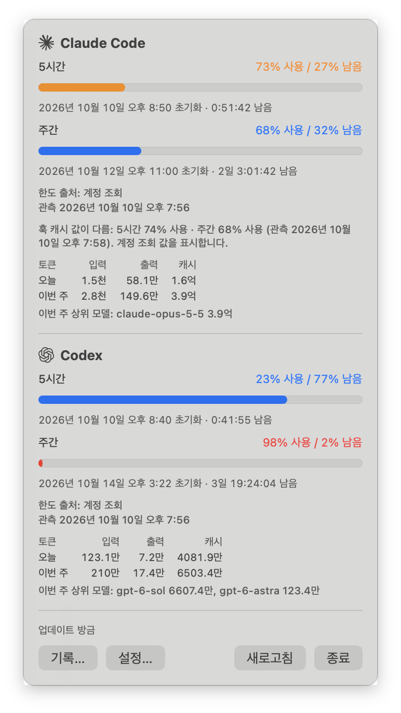
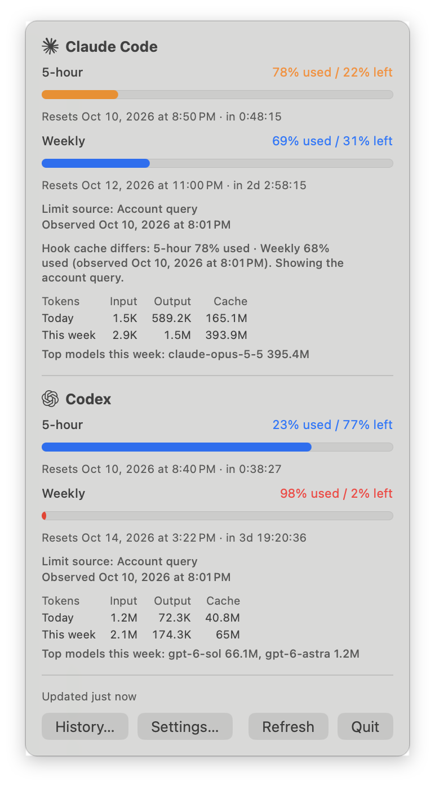

# Token Glance

**[한국어](#한국어)** · **[English](#english)**

macOS 메뉴바에서 Claude Code와 Codex 사용 한도를 한눈에 봅니다.
Claude Code & Codex usage limits at a glance, in your macOS menu bar.


---

## 한국어

> **상태:** 첫 릴리스(v0.1.0) 준비 중입니다. Apple Silicon(arm64) 전용이며, 앱은 ad-hoc 서명만 되어
> 있고 **공증(notarization)되지 않았습니다**. 릴리스가 게시되기 전에는 소스에서 빌드하세요.

Token Glance는 Claude Code와 Codex CLI의 **5시간 세션** 한도와 **주간** 한도가 얼마나 남았는지
메뉴바에 두 줄로 보여줍니다.

```
[C] 62%
[X] 80%
```

클릭하면 상세 패널이 열립니다. 윈도우별 게이지와 `N% 사용 / M% 남음`, 초기화 시각과 실시간
카운트다운, 오늘·이번 주 사용 토큰(입력 / 출력 / 캐시, 상위 모델)을 보여줍니다.

### 스크린샷

| 상세 패널 (라이트) | 상세 패널 (다크) |
|---|---|
|  |  |


macOS 26.6에서 **선택 기능인 온라인 조회를 켠 상태**로 찍었습니다(기록 창은 다크 모드). "한도
출처"와 "관측" 줄은 이때만 보이며, 새로 설치하면 온라인 조회는 꺼져 있습니다. 숫자는 작성자 Mac의
실제 사용량입니다. 메뉴바의 주황 27%는 Claude 5시간 한도가 30% 이하로 남아 경고 색으로 표시된
것입니다.

### 기능

- 두 줄 라벨(도구를 하나만 켜면 한 줄). 남은 양이 30% 이하이면 주황, 10% 이하이면 빨강.
- 남은 %(기본) 또는 사용 % 표시. 상세 패널의 게이지도 같은 방식으로 채워집니다(남은 양 또는
  사용한 양).
- 새 활동 후 몇 초 안에 갱신(FSEvents)되며, 로그에서 새로 추가된 바이트만 읽습니다.
- 값이 없을 때(`--`) 이유를 보여줍니다: 훅 미설치, 아직 데이터 없음, 데이터가 너무 오래됨 등.
- 설정: 표시 방식, 도구 켜기/끄기(다시 켜면 바로 다시 표시), 로그 폴더 지정, 로그인 시 열기, 언어,
  알림, Claude 훅 설치/복구/제거.
- 선택 알림(기본 꺼짐): 남은 %가 30% / 10%(변경 가능)를 지나 내려갈 때, 그리고 한도가 부족했다가
  새 윈도우가 시작될 때.
- 한국어와 영어. 기본은 시스템 언어를 따르고 설정에서 고를 수 있습니다.
- 로컬 로그 기반의 14일 기록 창(도구별 일별 토큰).
- 선택 기능: 설치된 Codex App Server를 통한 Codex 온라인 한도 조회(기본 꺼짐).
- 선택 기능: 설치된 Claude Code를 통한 Claude 온라인 한도 조회(기본 꺼짐, 실험적·비공식 경로를
  사용합니다. 프라이버시와 한계 항목을 참고하세요).

### 숫자를 가져오는 방법

| | 한도(%와 초기화 시각) | 토큰 |
|---|---|---|
| **Claude Code** | 기본적으로 Claude Code는 이 값을 **statusline 명령**에만 넘깁니다. 작은 훅이 값을 기록한 뒤, 같은 입력으로 기존 statusline을 그대로 실행합니다. 온라인 조회를 켜면 설치된 Claude Code가 받아 온 최근 플랜 한도가 우선하고, 조회가 실패하면 사유와 마지막 관측 시각을 표시하며 훅 캐시로 돌아갑니다. | `~/.claude/projects/**/*.jsonl` (`CLAUDE_CONFIG_DIR` 반영). 온라인 응답은 토큰 합계를 대체하지 않습니다. |
| **Codex CLI** | 기본적으로 `~/.codex/sessions/**/rollout-*.jsonl`의 `token_count` 이벤트(`CODEX_HOME` 반영). 온라인 조회를 켜면 설치된 Codex App Server의 유효한 계정 한도가 우선하고, 실패하면 사유와 마지막 관측 시각을 표시하며 로컬 한도로 돌아갑니다. | 로컬 rollout 파일만 사용. 온라인 사용량은 더하지 않습니다. |

형식의 자세한 내용은 [docs/log-schemas.md](docs/log-schemas.md)에 있습니다.

### 프라이버시

- **온라인 조회 꺼짐(기본):** 자식 프로세스, 네트워크 요청, 자격 증명 접근이 없습니다. 한도와 토큰
  합계는 로컬 파일에서만 가져옵니다.
- **Claude 온라인 조회 켬:** 설정에서 동의하면 Token Glance가 설치된 `claude`를 약 5분마다(그리고
  새로고침, 앱 시작, 깨어날 때, Claude 윈도우 초기화 때) 프롬프트 없는 헤드리스 모드(`--safe-mode`,
  `--no-session-persistence`, 텔레메트리 끔)로 실행해 `get_usage` 제어 요청을 한 번 보냅니다.
  Claude Code는 자기 로그인으로 Anthropic 서버의 무문서 엔드포인트에서 플랜 사용량을 받아 옵니다.
  Token Glance는 토큰, 키체인 항목, 자격 증명 파일을 읽거나 저장하거나 바꾸지 않습니다. Claude Code
  자체는 평소처럼 로그인을 갱신할 수 있고, 자기 상태에 짧게 사용량 스냅샷을 남깁니다. 퍼센트와
  초기화 시각만 메모리에 보관합니다. 옵션을 끄면 진행 중인 조회도 취소됩니다.
- **Codex 온라인 조회 켬:** 설정에서 동의하면 Token Glance가 설치된 Codex App Server를 자식
  프로세스로 실행합니다. Codex는 기존 로그인을 사용하며 계정 한도를 위해 네트워크 요청을 할 수
  있습니다. Token Glance는 인증 파일이나 키체인을 직접 읽지 않습니다. 한도는 5분마다 또는 수동
  새로고침 때 갱신되고, 업데이트 알림은 보조 신호로 씁니다.
- 프롬프트와 응답 내용은 저장·기록·전송하지 않습니다. 숫자(토큰 수, 퍼센트, 초기화 시각, 모델명)만
  메모리에서 사용합니다.
- 훅은 한도 값만 `~/Library/Application Support/TokenGlance/claude-rate-limits.json`에 씁니다.
  경로, 세션 ID, 이름은 쓰지 않습니다.
- 훅을 설치하면 Claude Code `settings.json`의 키 하나(`statusLine.command`)만 바꿉니다. 사용자가
  확인한 뒤, 파일 전체를 백업한 다음에만 바꾸며, 제거하면 원래대로 돌아갑니다.

### 설치

macOS 14 이상이 필요합니다.

#### 릴리스에서 설치 (Apple Silicon)

[Releases](https://github.com/yim0327/token-glance/releases) 페이지에 릴리스가 게시되면:

1. `TokenGlance-<version>-macos-arm64.zip`과 `.sha256` 파일을 내려받아 확인합니다:
   `shasum -a 256 -c TokenGlance-<version>-macos-arm64.zip.sha256`
2. 압축을 풀고 `TokenGlance.app`을 `/Applications`로 옮깁니다.
3. 앱을 엽니다. 공증되지 않은 앱(Apple Developer 계정 없음)이라 macOS가 처음 실행을 막습니다.
   **시스템 설정 › 개인정보 보호 및 보안**에서 Token Glance에 대한 메시지를 찾아 **그래도 열기**를
   누르고 확인합니다. 체크섬이 일치하는 다운로드에만 이렇게 하세요.

릴리스 zip은 게시 전에 로컬에서 확인(체크섬, 서명, 리소스, 실행)하지만, 내려받은 파일이 거치는
Gatekeeper 확인을 대신하지는 않습니다.

#### 소스에서 빌드

Swift 5.10 이상(Xcode 또는 Command Line Tools)이 필요합니다. 직접 빌드한 앱은 격리 속성이 붙지
않아 바로 열립니다.

```sh
git clone https://github.com/yim0327/token-glance.git
cd token-glance
./scripts/bundle-app.sh        # dist/TokenGlance.app 생성 (ad-hoc 서명, 이 Mac의 아키텍처)
open dist/TokenGlance.app
```

#### Claude 한도 훅

메뉴바 항목을 클릭하고 **설정…**을 열어 "Claude 한도 훅"에서 **설치…**를 누릅니다. 터미널에서도
할 수 있습니다:

```sh
/Applications/TokenGlance.app/Contents/Resources/token-glance-hook install   # settings.json을 먼저 백업
~/Library/Application\ Support/TokenGlance/bin/token-glance-hook status     # installed / overwritten / …
~/Library/Application\ Support/TokenGlance/bin/token-glance-hook repair     # 다른 도구가 statusline을 바꾼 뒤
~/Library/Application\ Support/TokenGlance/bin/token-glance-hook uninstall
```

`repair`는 그 시점에 설정된 statusline을 체이닝하므로, 이후 `uninstall`은 그 statusline으로
되돌립니다.

"로그인 시 Token Glance 열기"는 `SMAppService`를 쓰며 앱의 현재 위치에 묶입니다(앱을 옮기면 다시 켜세요).
macOS가 시스템 설정 › 일반 › 로그인 항목에서 승인을 요청할 수 있습니다.

### 개발

```sh
swift build
./scripts/test.sh     # `swift test`. Command Line Tools만 있어도 테스트가 실제로 실행됩니다
dist/TokenGlance.app/Contents/MacOS/TokenGlance --print-state   # UI 없이 라벨과 툴팁을 한 번 출력
```

릴리스 패키징: `./scripts/package-release.sh`가 zip과 SHA-256을 `dist/release`에 씁니다.
`VERSION`과 일치하는 `v*` 태그를 push하면 테스트를 실행하고 **draft** GitHub Release를 만듭니다.

설계 결정: [docs/adr](docs/adr).

### 성능

Apple Silicon Mac 한 대(macOS 26.6)에서 릴리스 빌드와 측정 전용 드라이버로, **온라인 조회를 끈
상태**에서 Claude Code가 로그를 쓰는 동안 측정했습니다. 창을 93번 열고 닫은 22분 동안 CPU 평균
0.77%(사이 유휴 구간 0.02~0.53%)였습니다. physical footprint는 창을 열기 전 약 18MB, 패널·설정·기록
창을 한 번씩 쓴 뒤 42~45MB였고(각 창 30회 반복 동안 안정), 가장 높았던 값은 48.5MB입니다. Codex
온라인 조회를 켜면 App Server 자식 프로세스가 약 40MB를 더 씁니다. 방법과 전체 측정:
[docs/perf.md](docs/perf.md).

### 한계

- 릴리스 zip은 Apple Silicon 전용이며 공증되지 않았습니다(설치 참고).
- 한도는 퍼센트로만 제공됩니다. 두 도구 모두 구독 플랜의 남은 토큰 수를 알려주지 않습니다.
- Claude 한도는 Claude Code가 실행 중일 때만 갱신됩니다(statusline으로 들어오기 때문). 7일보다 오래된
  값은 숨기고, 초기화 시각이 지난 윈도우는 초기화됨으로 표시합니다.
- 로그 형식은 문서화되지 않았고 바뀔 수 있습니다. 모르는 필드는 무시하고 읽을 수 없는 줄은 건너뜁니다.
- Codex 한도 필드는 세션이 적은 한 대의 기기에서만 검증했습니다(docs/log-schemas.md §2).
- 24시간 넘게 쉬었다가 재개한 Codex 세션은 5분 폴백 폴링으로만 갱신될 수 있습니다.
- 알림은 앱이 실행 중일 때의 새 관측에만 반응합니다. Mac이 잠자거나 앱이 꺼져 있던 동안의 변화는
  나중에 보내지 않습니다.
- 기록 차트는 이 Mac의 로그만 셉니다. 가장 오래된 로그 이전의 날은 사용량 0이 아니라 로그 없음으로
  표시합니다.
- Codex 온라인 조회에는 App Server 한도 메서드가 있는 Codex가 필요합니다(codex-cli 0.162.0에서 검증).
  API 키 로그인은 ChatGPT 구독 한도를 제공하지 않습니다. 여러 한도 버킷은 합치지 않고, 없는 값은
  없는 대로 둡니다. Aside 사용분이 계정 한도에 어떻게 귀속되는지는 확인되지 않았습니다.
- 로컬 rollout 로그에는 검증된 계정 식별 정보가 없습니다. 폴백 한도가 다른 계정의 값일 수 있으며, 앱은
  출처를 표시하고 계정 한도 버킷과 섞지 않습니다.
- 온라인 조회를 켜면 App Server 자식 프로세스 때문에 합산 메모리가 50MB 목표를 넘을 수 있습니다
  (5분 측정 한 번에서 평균 59.7MB). [성능 기록](docs/perf.md)을 참고하세요.
- Claude 온라인 조회는 **공식 지원 API가 아닙니다**. Claude Code의 실험적 `get_usage` 제어 요청
  (Claude Code 2.1.296에서 검증)을 쓰며, 이 요청은 무문서 서버 엔드포인트를 읽습니다. 둘 다 예고 없이
  바뀌거나 멈출 수 있고, 그러면 훅 캐시 값을 보여줍니다. 이 사용이 계정 약관상 허용되는지는 사용자가
  확인해야 합니다. API 키·클라우드 제공자 로그인에는 플랜 한도가 없습니다. 모델별 주간 한도는 표시하지
  않습니다. 조회마다 `claude` 프로세스가 잠깐 실행됩니다(약 0.3초 CPU, 실행 중 약 230MB 상주 메모리).

### 설계 원칙

- 두 도구(Claude Code와 Codex)만 다루며, 두 줄 라벨로 둘을 동시에 보여줍니다.
- 공식·로컬 경로 우선: 기본적으로 Claude 한도는 Claude Code가 statusline에 넘기는 입력에서, Codex
  한도는 로컬 로그에서 가져옵니다. 웹 세션이나 비공개 API를 쓰지 않습니다. 선택 기능인 온라인 조회
  (기본 꺼짐)는 설치된 Claude Code와 Codex에 대신 물어봅니다.
- 기본 설정에서 네트워크 접근이 없고 권한은 최소한입니다.
- 작고 읽기 쉬운 코드베이스, 익명화한 fixture로 테스트합니다.

### 라이선스

MIT. [LICENSE](LICENSE)를 참고하세요.

[맨 위로](#token-glance)

---

## English

> **Status:** first release (v0.1.0) in preparation. Apple Silicon (arm64) only; the app is ad hoc
> signed and **not notarized**. Until a release is published, build from source.

Token Glance shows how much of the **5-hour session** and **weekly** limits you have left in
Claude Code and Codex CLI, as a two-line menu bar label:

```
[C] 62%
[X] 80%
```

Click it for details: per-window gauges with `N% used / M% left`, reset times with a live
countdown, and tokens used today and this week (input / output / cache, top models).

### Screenshots

| Details panel (light) | Details panel (dark) |
|---|---|
|  |  |


Captured on macOS 26.6 with the **optional online checks turned on** (history window in dark mode).
The "Limit source" and "Observed" lines appear only then; a new install has the online checks off.
The numbers are real usage on the author's Mac. The orange 27% in the menu bar is the Claude 5-hour
limit shown in the warning color at 30% left or less.

### Features

- Two-line label (one line when only one tool is enabled), orange at 30% left or less, red at 10%.
- Remaining % (default) or used %; the details panel gauges fill the same way (what is left, or
  what is used).
- Updates within seconds of new activity (FSEvents), reading only the bytes appended to logs.
- Shows why a value is missing (`--`): hook not installed, no data yet, data too old, …
- Settings: display mode, tools on/off (turning a tool back on shows it again immediately), custom
  log folders, open at login, language, notifications, Claude hook install/repair/uninstall.
- Optional notifications (off by default) when the remaining percentage drops past 30% / 10%
  (configurable), and when a new window starts after running low.
- English and Korean, following the system language by default or chosen in settings.
- A 14-day history window with daily tokens per tool, from local logs.
- Optional Codex online limit checks through the installed Codex App Server (off by default).
- Optional Claude online limit checks through the installed Claude Code (off by default; uses an
  experimental, unofficial path — see Privacy and Limitations).

### How it gets the numbers

| | Limits (% and reset time) | Tokens |
|---|---|---|
| **Claude Code** | By default, Claude Code passes them only to **statusline commands**. A small hook records them and then runs your existing statusline with the same input. With online checks enabled, a recent plan-limit answer from the installed Claude Code takes priority; failed checks fall back to the hook cache with a reason and last observation time. | `~/.claude/projects/**/*.jsonl` (respects `CLAUDE_CONFIG_DIR`); online answers never replace token totals. |
| **Codex CLI** | By default, `token_count` events in `~/.codex/sessions/**/rollout-*.jsonl` (respects `CODEX_HOME`). With online checks enabled, valid account limits from the installed Codex App Server take priority; failed checks fall back to local limits with a reason and last observation time. | Local rollout files only; online usage totals are not added. |

Details of the formats are in [docs/log-schemas.md](docs/log-schemas.md).

### Privacy

- **Online checks off (default):** no child processes, network requests or credential access; limits and token totals come from local files.
- **Claude online checks on:** after you consent in Settings, Token Glance starts the installed
  `claude` about every five minutes (and on Refresh, launch, wake and a Claude window reset) in headless
  mode with no prompt (`--safe-mode`, `--no-session-persistence`, telemetry off) and sends one
  `get_usage` control request. Claude Code uses its own login and requests the plan usage from
  Anthropic's servers through an undocumented endpoint. Token Glance never reads, stores or changes
  the token, the Keychain item or the credentials file; Claude Code itself may refresh its login as it
  normally does and keeps a short-lived usage snapshot in its own state. Only percentages and reset
  times are kept, in memory. Turning the option off cancels a running check.
- **Codex online checks on:** after you consent in Settings, Token Glance starts the installed Codex App Server as a child process. Codex uses your existing login and may make network requests for account limits. Token Glance does not directly read authentication files or Keychain. Limits refresh every five minutes or on manual refresh; update notifications are an additional signal.
- Prompt and response text is never stored, logged or sent. Only numbers (token counts,
  percentages, reset times, model names) are used, and only in memory.
- The hook writes just the limit values to
  `~/Library/Application Support/TokenGlance/claude-rate-limits.json`; no paths, session ids or names.
- Installing the hook changes one key (`statusLine.command`) in Claude Code's `settings.json`,
  only after you confirm, and only after backing up the whole file. Uninstall restores it.

### Install

Requires macOS 14+.

#### From a release (Apple Silicon)

Once a release is published on the [Releases](https://github.com/yim0327/token-glance/releases)
page:

1. Download `TokenGlance-<version>-macos-arm64.zip` and its `.sha256` file, then check it:
   `shasum -a 256 -c TokenGlance-<version>-macos-arm64.zip.sha256`
2. Unzip and move `TokenGlance.app` to `/Applications`.
3. Open it. Because the app is not notarized (no Apple Developer account), macOS blocks the first
   launch. Go to **System Settings › Privacy & Security**, find the message about Token Glance and
   choose **Open Anyway**, then confirm. Do this only for a download whose checksum matches.

The release zip is checked locally before publishing (checksum, signature, resources, launch), but
that does not replace the Gatekeeper check a downloaded copy goes through.

#### From source

Requires Swift 5.10+ (Xcode or the Command Line Tools). A locally built app is not quarantined and
opens directly.

```sh
git clone https://github.com/yim0327/token-glance.git
cd token-glance
./scripts/bundle-app.sh        # builds dist/TokenGlance.app (ad hoc signed, this Mac's architecture)
open dist/TokenGlance.app
```

#### Claude limits hook

Click the menu bar item, open **Settings…** and choose **Install…** under "Claude limits hook". The
same can be done from a terminal:

```sh
/Applications/TokenGlance.app/Contents/Resources/token-glance-hook install   # backs up settings.json first
~/Library/Application\ Support/TokenGlance/bin/token-glance-hook status     # installed / overwritten / …
~/Library/Application\ Support/TokenGlance/bin/token-glance-hook repair     # after another tool replaced the statusline
~/Library/Application\ Support/TokenGlance/bin/token-glance-hook uninstall
```

`repair` chains whatever statusline is set at that moment, so a later `uninstall` restores that one.

"Open at login" uses `SMAppService` and is tied to the app's current location (turn it on again
after moving the app). macOS may ask you to approve it in System Settings › General › Login Items.

### Development

```sh
swift build
./scripts/test.sh     # `swift test`; also runs the tests when only the Command Line Tools are installed
dist/TokenGlance.app/Contents/MacOS/TokenGlance --print-state   # label and tooltip once, no UI
```

Release packaging: `./scripts/package-release.sh` writes the zip and its SHA-256 to `dist/release`.
Pushing a `v*` tag that matches `VERSION` runs the tests and creates a **draft** GitHub Release.

Design decisions: [docs/adr](docs/adr).

### Performance

Measured on one Apple Silicon Mac (macOS 26.6) with a release build plus the measurement-only driver, **online checks off**,
while Claude Code was writing logs: CPU 0.77% on average over a 22-minute run that opened and closed
windows 93 times (0.02–0.53% in the idle minutes between), physical footprint about 18 MB
before any window is opened and 42–45 MB once the panel, settings and history windows have been
used (stable over 30 open/close cycles of each); the highest footprint seen was 48.5 MB. With Codex
online checks on, its App Server child adds about 40 MB. Methods and all runs:
[docs/perf.md](docs/perf.md).

### Limitations

- Apple Silicon only for the release zip; not notarized (see Install).
- Limits are percentages only; neither tool exposes remaining token counts for subscription plans.
- Claude limits update only while Claude Code runs (they arrive through the statusline). Values
  older than 7 days are hidden; a window whose reset time has passed shows as reset.
- Log formats are undocumented and may change. Unknown fields are ignored and unreadable lines skipped.
- Codex limit fields were verified on one machine with few sessions (see docs/log-schemas.md §2).
- Codex sessions idle for more than 24 hours and then resumed may update only with the 5-minute
  fallback poll.
- Notifications only react to new observations while the app is running; changes that happened
  while the Mac was asleep or the app was closed are not sent afterwards.
- The history chart counts only logs on this Mac. Days before the oldest log are shown as having
  no logs, not as zero usage.
- Codex online checks require an installed Codex version with the App Server rate-limit methods (verified in codex-cli 0.162.0). API-key logins do not provide ChatGPT subscription limits. Multiple limit buckets stay separate; missing values remain unavailable. Aside usage attribution to account limits is unverified.
- Local rollout logs do not carry a verified account identity. A fallback limit may belong to a different account; the app labels its source and never combines it with account-limit buckets.
- With online checks enabled, the App Server child can raise combined physical memory above the 50 MB target (59.7 MB average in one 5-minute measurement). See [performance notes](docs/perf.md).
- Claude online checks are **not an official, supported API**. They use Claude Code's experimental
  `get_usage` control request (verified on Claude Code 2.1.296), which reads an undocumented server
  endpoint; either can change or stop without notice, and then the hook cache is shown. Whether this
  use is allowed under the terms for your account is for you to check. API-key and cloud-provider
  logins have no plan limits. Scoped weekly meters (per model) are not shown. Each check briefly runs
  a `claude` process (about 0.3 s CPU and ~230 MB resident memory while it runs).

### Design choices

- Two tools only (Claude Code and Codex), both visible at once in a two-line label.
- Official/local paths first: by default, Claude limits come from Claude Code's own statusline
  input, not from web sessions or private APIs, and Codex limits from its local logs. The optional
  online checks (off by default) ask the installed Claude Code and Codex instead.
- No network access and minimal permissions by default.
- A small, readable codebase with tests against anonymized fixtures.

### License

MIT. See [LICENSE](LICENSE).

[Back to top](#token-glance)

---

Anthropic 또는 OpenAI와 제휴하거나 후원·보증·승인을 받은 프로젝트가 아닙니다. 메뉴바와 상세 패널의
Claude 마크와 OpenAI Blossom은 어느 서비스의 수치인지 구분하기 위해서만 씁니다. "Claude", "Codex",
"OpenAI", "Anthropic"과 해당 마크는 각 소유자의 상표입니다. MIT 라이선스는 코드에만 적용되며 이
상표에 대한 권리를 주지 않습니다. 출처, 그리는 방식, 미해결 사항: [docs/trademarks.md](docs/trademarks.md).

Not affiliated with, sponsored, endorsed or approved by Anthropic or OpenAI. The menu bar and the
details panel show the Claude mark and the OpenAI Blossom only to identify which service a number
belongs to; "Claude", "Codex", "OpenAI", "Anthropic" and those marks are trademarks of their
respective owners. The MIT license covers the code only and grants no rights to them. Sources, how
the marks are drawn and what is unresolved: [docs/trademarks.md](docs/trademarks.md).
