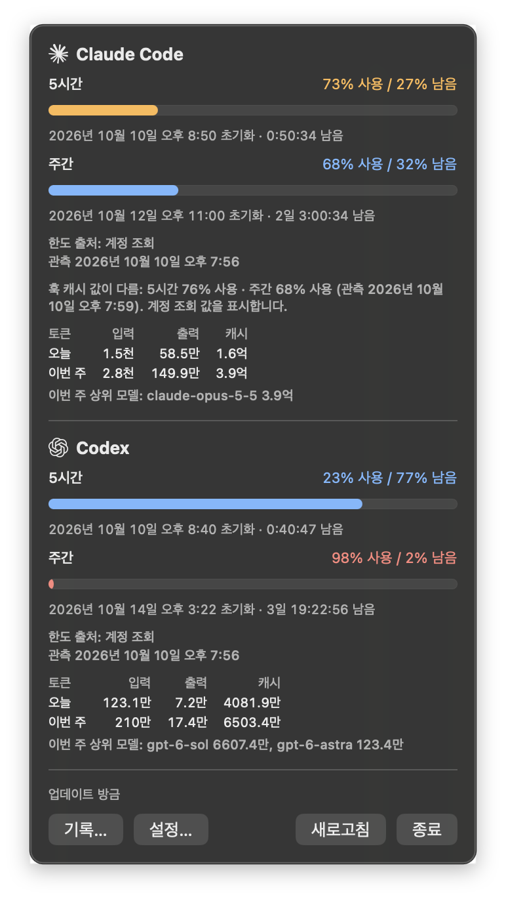
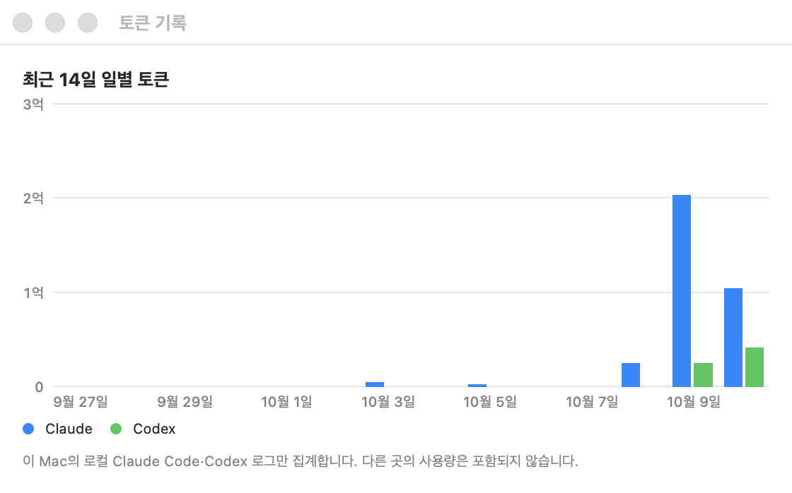
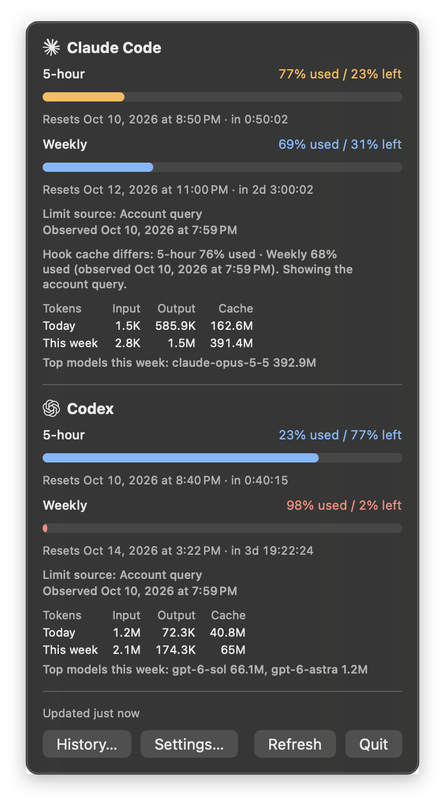
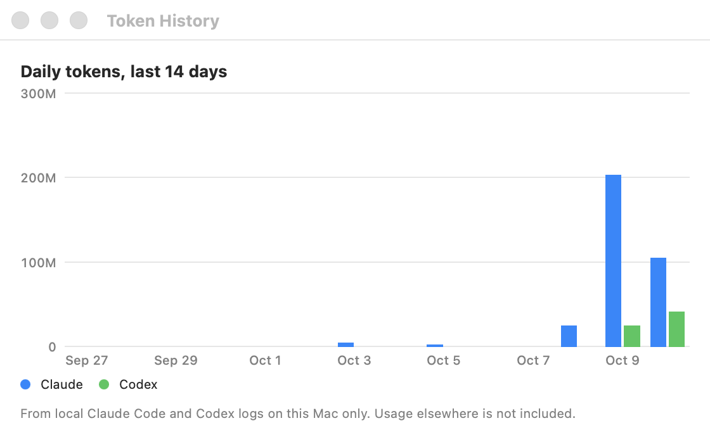

# Token Glance

**[한국어](#한국어)** · **[English](#english)**

macOS 메뉴바에서 Claude Code와 Codex 사용 한도를 한눈에 봅니다.
Claude Code & Codex usage limits at a glance, in your macOS menu bar.


---

## 한국어

> **Apple Silicon(arm64) 전용 · macOS 14 이상 · 공증(notarization)되지 않은 앱**
>
> 첫 릴리스 [v0.1.0](https://github.com/yim0327/token-glance/releases/tag/v0.1.0)이 게시되었습니다.
> [릴리스에서 설치](#릴리스에서-설치)하거나 [소스에서 빌드](#소스에서-빌드)할 수 있습니다.

Token Glance는 Claude Code와 Codex CLI의 **5시간 세션 한도**와 **주간 한도**가 얼마나 남았는지
메뉴바에 두 줄로 보여줍니다. 클릭하면 초기화 시각과 사용 토큰을 담은 상세 패널이 열립니다.



선택 기능인 온라인 조회를 켠 상태로 macOS 26.6에서 찍었습니다. "한도 출처"와 "관측" 줄은 온라인
조회를 켰을 때만 보입니다.

### 기능

- 도구마다 한 줄씩, 남은 %(또는 사용 %)를 표시합니다. 30% 이하로 남으면 주황, 10% 이하이면
  빨강입니다.
- 상세 패널: 5시간·주간 게이지, 초기화 시각과 카운트다운, 오늘·이번 주 사용 토큰(입력·출력·캐시,
  상위 모델).
- 새 활동 후 몇 초 안에 갱신됩니다. 값이 없으면 `--`와 함께 이유를 보여줍니다.
- 14일 기록 창: 도구별 일별 토큰(로컬 로그 기준).
- 선택 알림(기본 꺼짐): 남은 %가 30%·10%(변경 가능)를 지나 줄어들 때, 한도가 부족했다가 새
  윈도우가 시작될 때.
- 한국어·영어. 기본은 시스템 언어를 따릅니다.
- 선택 기능(기본 꺼짐): 설치된 Claude Code·Codex를 통한 온라인 한도 조회.



### 설치

필요한 것: Apple Silicon Mac, macOS 14 이상, Claude Code 또는 Codex CLI.

#### 릴리스에서 설치

[Releases](https://github.com/yim0327/token-glance/releases)의 최신 릴리스에서:

1. `TokenGlance-<버전>-macos-arm64.zip`과 같은 이름의 `.sha256` 파일을 내려받습니다.
2. 두 파일이 있는 폴더에서 체크섬을 확인합니다.

   ```sh
   shasum -a 256 -c TokenGlance-0.1.0-macos-arm64.zip.sha256
   ```

3. Finder에서 zip을 더블클릭해 압축을 풀고, `TokenGlance.app`을 Finder에서 **응용 프로그램**
   (`/Applications`) 폴더로 끌어다 놓습니다. 터미널의 `mv`로 옮겼을 때는 앱이 App Translocation
   경로(macOS가 정한 임시 위치)에서 실행되는 것이 관찰됐습니다. "로그인 시 열기"는 앱 위치에
   묶이므로 옮긴 뒤에 켭니다([문제 해결](#문제-해결)).
4. 앱을 엽니다. 공증되지 않은 앱이라 macOS가 처음 실행을 막습니다. **시스템 설정 › 개인정보 보호
   및 보안**에서 Token Glance 항목의 **그래도 열기**를 누르고 확인합니다. 체크섬이 일치한 파일에만
   이렇게 하세요.

릴리스 zip은 게시 전에 로컬에서 체크섬·서명·리소스·실행을 확인했고, v0.1.0은 게시 후 웹 브라우저로
내려받은 파일로 체크섬과 **그래도 열기** 흐름도 확인했습니다(macOS 26.6.2, 한 대). 이 확인이 각
Mac에서 내려받은 파일이 거치는 Gatekeeper 확인을 대신하지는 않습니다.

#### 소스에서 빌드

Swift 6 툴체인에서 빌드를 확인했습니다: CI는 Swift 6.1(Xcode 16.4), 개발 기기는 Swift 6.3(Command
Line Tools). `Package.swift`는 swift-tools-version 5.10을 선언하지만, Swift 5.10 툴체인으로는 확인하지
않았습니다. 테스트(`./scripts/test.sh`)는 Swift 6 툴체인에 들어 있는 swift-testing이 필요합니다.
직접 빌드한 앱은 이 Mac의 아키텍처로 만들어지고 ad-hoc 서명되며, 내려받은 파일이 아니므로 Gatekeeper
확인 없이 열립니다.

```sh
git clone https://github.com/yim0327/token-glance.git
cd token-glance
./scripts/bundle-app.sh
open dist/TokenGlance.app
```

### 처음 실행

Token Glance는 메뉴바에만 나타납니다(Dock 아이콘 없음).

1. **Codex**: 따로 할 일이 없습니다. Codex 세션 로그(`~/.codex/sessions`, `CODEX_HOME` 반영)에서
   한도와 토큰을 읽습니다. Codex를 한 번 사용하면 값이 나타납니다.
2. **Claude Code**: 한도를 보려면 **Claude 한도 훅**을 설치해야 합니다. Claude Code는 한도를
   statusline 명령에만 넘기기 때문입니다. 메뉴바 항목 › **설정…** › "Claude 한도 훅" › **설치…**를
   누르고 확인합니다.
   - 훅은 한도 값만 기록한 뒤, 이미 쓰던 statusline이 있으면 같은 입력으로 그대로 실행합니다.
   - 설치는 `~/.claude/settings.json`(또는 `CLAUDE_CONFIG_DIR`)의 `statusLine.command` 한 곳만
     바꾸며, 바꾸기 전에 파일 전체를 백업합니다. **제거**하면 원래 설정으로 돌아갑니다.
   - 설치 후 Claude Code가 응답을 한 번 받으면 값이 나타납니다.
3. 나머지 설정(표시 방식, 도구 켜기/끄기, 로그 폴더, 로그인 시 열기, 언어, 알림)은 선택입니다.

터미널에서도 훅을 관리할 수 있습니다. 처음 설치는 앱 번들 안의 훅으로 합니다.

```sh
/Applications/TokenGlance.app/Contents/Resources/token-glance-hook install
```

설치 후에는 복사된 훅으로 상태 확인(`status`), 복구(`repair`), 제거(`uninstall`)를 합니다.
`repair`는 그 시점에 설정된 statusline을 체이닝하므로, 이후 `uninstall`은 그 statusline으로
되돌립니다.

```sh
~/Library/Application\ Support/TokenGlance/bin/token-glance-hook status
```

### 온라인 조회와 프라이버시

**기본 설정(온라인 조회 꺼짐)** 에서는 모든 처리가 이 Mac 안에서 끝납니다. 자식 프로세스를 띄우지
않고, 네트워크 요청을 하지 않으며, 인증 파일이나 키체인을 읽지 않습니다.

- 한도: Claude는 훅 캐시, Codex는 로컬 세션 로그.
- 토큰: Claude는 `~/.claude/projects/**/*.jsonl`(`CLAUDE_CONFIG_DIR` 반영), Codex는 로컬 세션 로그.
- 프롬프트와 응답 내용은 저장·기록·전송하지 않습니다. 토큰 수, 퍼센트, 초기화 시각, 모델명만
  메모리에서 씁니다.
- 훅은 한도 값만 `~/Library/Application Support/TokenGlance/claude-rate-limits.json`에 씁니다.
  경로, 세션 ID, 세션 이름은 쓰지 않습니다.

**온라인 조회(설정에서 도구별로 켬, 기본 꺼짐)** 는 켜기 전에 동의 창을 띄웁니다. 켜면 설치된
도구를 자식 프로세스로 실행하고, 그 도구가 자기 로그인으로 네트워크 요청을 합니다. Token Glance는
토큰·키체인 항목·인증 파일을 직접 읽거나 저장하지 않습니다. 받은 퍼센트와 초기화 시각만 메모리에
두며, 토큰 합계는 계속 로컬 로그만 씁니다. 조회가 실패하면 사유를 표시하고 로컬 값으로 돌아갑니다.

| | Codex 온라인 조회 | Claude 온라인 조회 |
|---|---|---|
| 실행하는 것 | 설치된 Codex의 App Server (조회 사이에도 실행 유지) | 설치된 `claude`를 프롬프트 없이 헤드리스로 (조회마다 잠깐 실행) |
| 조회 시점 | 약 5분마다, 새로고침, Codex 업데이트 알림 | 약 5분마다, 새로고침, 앱 시작, 깨어날 때, 윈도우 초기화 때 |
| 성격 | 공식 문서화된 App Server 메서드 | **공식 지원 API가 아님.** Claude Code의 실험적 `get_usage` 요청이 무문서 서버 엔드포인트를 읽습니다 |

Claude 온라인 조회는 `claude`를 `--safe-mode`, `--no-session-persistence`, 텔레메트리 끔으로
실행합니다. Token Glance가 자격 증명을 건드리지 않더라도, 자식 Claude Code는 평소처럼 자기 로그인을
갱신해 키체인에 다시 쓸 수 있고 자기 상태에 사용량 스냅샷을 짧게 남깁니다. 이 경로는 예고 없이
바뀌거나 멈출 수 있고, 그러면 훅 캐시 값을 보여줍니다. 이 사용이 계정 약관상 허용되는지는 사용자가
확인해야 합니다. 옵션을 끄면 진행 중인 조회와 자식 프로세스도 멈춥니다.

### 한계

- 릴리스 zip은 Apple Silicon 전용이고 공증되지 않았습니다.
- 한도는 퍼센트로만 제공됩니다. 두 도구 모두 남은 토큰 수를 알려주지 않습니다.
- Claude 한도는 훅만 쓸 때 Claude Code가 실행 중일 때만 갱신됩니다. 7일보다 오래된 값은 숨깁니다.
- 초기화 시각이 지난 윈도우는 새 관측이 올 때까지 "윈도우 초기화됨 — 새 데이터를 기다리는 중"으로 표시합니다.
- 로그·훅 형식은 비공식이라 바뀔 수 있습니다. 모르는 필드는 무시하고 읽을 수 없는 줄은 건너뜁니다.
- Codex 한도 필드는 세션이 적은 기기 한 대에서만 검증했습니다([docs/log-schemas.md](docs/log-schemas.md) §2).
- 24시간 넘게 쉬었다가 재개한 Codex 세션은 최대 5분 뒤에 갱신될 수 있습니다.
- 알림은 앱이 실행 중일 때만 보냅니다. 잠자기·종료 중의 변화는 나중에 보내지 않습니다.
- 기록 창은 이 Mac의 로그만 셉니다. 가장 오래된 로그 이전의 날은 "로그 없음"으로 표시합니다.
- Codex 온라인 조회:
  - App Server 한도 메서드가 있는 Codex가 필요합니다(codex-cli 0.162.0에서 확인).
  - ChatGPT 구독 로그인만 지원합니다. API 키 로그인에는 구독 한도가 없습니다.
  - 여러 한도 버킷은 합치지 않습니다. 로컬 로그에 남지 않는 사용이 계정 한도에 어떻게 반영되는지는
    확인하지 않았습니다.
  - 로컬 로그에는 계정 정보가 없어서, 폴백 값이 다른 계정의 것일 수 있습니다.
  - App Server 자식이 약 40MB를 더 써서 합산 메모리가 50MB 목표를 넘을 수 있습니다.
- Claude 온라인 조회:
  - Claude Code 2.1.296에서 확인했습니다.
  - 구독 로그인만 지원합니다. API 키·클라우드 제공자 로그인에는 플랜 한도가 없습니다.
  - 모델별 주간 한도는 표시하지 않습니다.
  - 조회마다 `claude` 프로세스가 1초 안팎 실행됩니다(약 0.3초 CPU, 실행 중 약 230MB).

### 문제 해결

| 증상 | 확인할 것 |
|---|---|
| 처음 열 때 "열 수 없음" | 위 설치 4단계의 **그래도 열기**를 사용합니다. 보안 설정 전체를 끄는 방법은 권하지 않습니다. |
| Claude가 `--`, "statusline 훅이 설치되지 않음" | 설정에서 Claude 한도 훅을 설치합니다. |
| "다른 statusline으로 바뀜" | 다른 도구가 statusline 설정을 바꾼 경우입니다. 설정에서 **복구…**를 누르면 새 statusline을 유지한 채 다시 연결합니다. |
| Claude 값이 오래됨 | Claude Code를 사용하면 갱신됩니다. 항상 최신 값이 필요하면 Claude 온라인 조회를 고려하세요. |
| Codex가 `--`, "아직 데이터 없음" | Codex를 한 번 사용합니다. 로그 폴더를 바꿨다면 설정의 "Codex 홈"을 확인합니다. |
| 온라인 조회 실패 사유가 보임 | 해당 도구가 설치·로그인되어 있는지 확인합니다. 그동안은 로컬 값을 표시합니다. |
| 로그인 시 열리지 않음 | "로그인 시 열기"는 앱 위치에 묶입니다. 앱을 옮겼다면 다시 켭니다. 시스템 설정 › 일반 › 로그인 항목에서 승인이 필요할 수 있습니다. |

**제거:** 먼저 설정에서 훅을 **제거**(또는 `token-glance-hook uninstall`)해 statusline을 되돌린 뒤
앱을 지웁니다. 남은 캐시와 훅 사본은 `~/Library/Application Support/TokenGlance`에 있습니다. 훅 설치
때 만든 백업은 `settings.json.token-glance-backup-<시각>` 이름으로 settings.json 옆에 남습니다.

### 문서와 개발

- [로그·훅 형식과 검증 기록](docs/log-schemas.md) · [성능 측정](docs/perf.md) ·
  [설계 결정(ADR)](docs/adr) · [제품 요구사항(PRD)](docs/PRD.md) · [진행 상황](docs/PROGRESS.md)
- [개발 기록](docs/development.md): 단계별 진행, 실사용에서 발견한 문제와 수정, AI 도구와 작업한
  방식
- 빌드와 테스트: `swift build`, `./scripts/test.sh`(Command Line Tools만 있어도 테스트가 실제로
  실행됩니다).
- 릴리스 패키징: `./scripts/package-release.sh`가 `dist/release`에 zip과 SHA-256을 만듭니다.
  `VERSION`과 일치하는 `v*` 태그를 push하면 CI가 테스트 후 **draft** Release를 만듭니다.
- 앱 아이콘: 원본은 `assets/AppIcon/AppIcon.svg`(자체 디자인)입니다. 바꾼 뒤
  `./scripts/make-app-icon.sh`로 `AppIcon.icns`를 다시 만들어 두 파일을 함께 커밋합니다.

### 라이선스와 고지

MIT. [LICENSE](LICENSE)를 참고하세요.

Anthropic 또는 OpenAI와 제휴하거나 후원·보증·승인을 받은 프로젝트가 아닙니다. 메뉴바와 상세 패널의
Claude 마크와 OpenAI Blossom은 어느 서비스의 수치인지 구분하기 위해서만 씁니다. "Claude", "Codex",
"OpenAI", "Anthropic"과 해당 마크는 각 소유자의 상표입니다. MIT 라이선스는 코드에만 적용되며 이
상표에 대한 권리를 주지 않습니다. 출처, 그리는 방식, 미해결 사항: [docs/trademarks.md](docs/trademarks.md).

[맨 위로](#token-glance)

---

## English

> **Apple Silicon (arm64) only · macOS 14 or later · not notarized**
>
> The first release, [v0.1.0](https://github.com/yim0327/token-glance/releases/tag/v0.1.0), is published.
> [Install it from the release](#from-a-release) or [build from source](#from-source).

Token Glance shows how much of the **5-hour session limit** and the **weekly limit** you have left in
Claude Code and Codex CLI, as a two-line menu bar label. Click it for a details panel with reset times
and token usage.



Captured on macOS 26.6 with the optional online checks turned on. The "Limit source" and "Observed"
lines appear only when online checks are on.

### Features

- One line per tool with the remaining % (or used %): orange at 30% left or less, red at 10% or less.
- Details panel: 5-hour and weekly gauges, reset times with a countdown, tokens used today and this
  week (input, output, cache, top models).
- Updates within seconds of new activity. A missing value shows `--` with the reason.
- 14-day history window with daily tokens per tool (from local logs).
- Optional notifications (off by default) when the remaining % drops past 30% / 10% (configurable),
  and when a new window starts after running low.
- English and Korean, following the system language by default.
- Optional (off by default): online limit checks through the installed Claude Code and Codex.



### Install

You need an Apple Silicon Mac, macOS 14 or later, and Claude Code or Codex CLI.

#### From a release

From the latest release on the [Releases](https://github.com/yim0327/token-glance/releases) page:

1. Download `TokenGlance-<version>-macos-arm64.zip` and the `.sha256` file with the same name.
2. In the folder with both files, check the checksum.

   ```sh
   shasum -a 256 -c TokenGlance-0.1.0-macos-arm64.zip.sha256
   ```

3. Unzip it by double-clicking the zip in Finder, then drag `TokenGlance.app` in Finder into the
   **Applications** folder (`/Applications`). When the app was moved with `mv` in Terminal instead, it
   was observed running from an App Translocation path (a temporary location chosen by macOS).
   "Open at login" is tied to the app's location, so turn it on after moving the app
   ([Troubleshooting](#troubleshooting)).
4. Open it. The app is not notarized, so macOS blocks the first launch. In **System Settings ›
   Privacy & Security**, choose **Open Anyway** for Token Glance and confirm. Do this only for a
   file whose checksum matched.

The release zip was checked locally before publishing (checksum, signature, resources, launch), and
after v0.1.0 was published, a copy downloaded with a web browser was checked as well (checksum and
the **Open Anyway** flow, macOS 26.6.2, one Mac). That does not replace the Gatekeeper check a
downloaded file goes through on each Mac.

#### From source

Builds were checked with Swift 6 toolchains: Swift 6.1 (Xcode 16.4) on CI and Swift 6.3 (Command Line
Tools) on the development Mac. `Package.swift` declares swift-tools-version 5.10, but a Swift 5.10
toolchain has not been tried. The tests (`./scripts/test.sh`) need swift-testing, which ships with
Swift 6 toolchains. A locally built app is built for this Mac's architecture and ad hoc signed; it was
not downloaded, so it opens without a Gatekeeper check.

```sh
git clone https://github.com/yim0327/token-glance.git
cd token-glance
./scripts/bundle-app.sh
open dist/TokenGlance.app
```

### First run

Token Glance appears only in the menu bar (no Dock icon).

1. **Codex**: nothing to set up. Limits and tokens come from the Codex session logs
   (`~/.codex/sessions`, respects `CODEX_HOME`). Values appear after you use Codex once.
2. **Claude Code**: install the **Claude limits hook** to see limits, because Claude Code passes them
   only to statusline commands. Choose menu bar item › **Settings…** › "Claude limits hook" ›
   **Install…** and confirm.
   - The hook records only the limit values, then runs your existing statusline, if any, with the
     same input.
   - Installing changes only `statusLine.command` in `~/.claude/settings.json` (or
     `CLAUDE_CONFIG_DIR`), after backing up the whole file. **Uninstall** restores the original.
   - Values appear after Claude Code receives its next response.
3. Everything else (display mode, tools on/off, log folders, open at login, language,
   notifications) is optional.

The hook can also be managed from a terminal. The first install uses the hook inside the app bundle.

```sh
/Applications/TokenGlance.app/Contents/Resources/token-glance-hook install
```

After that, the installed copy handles `status`, `repair` and `uninstall`. `repair` chains the
statusline set at that moment, so a later `uninstall` restores that statusline.

```sh
~/Library/Application\ Support/TokenGlance/bin/token-glance-hook status
```

### Online checks and privacy

**By default (online checks off)** everything stays on this Mac: no child processes, no network
requests, and no access to authentication files or the Keychain.

- Limits: the hook cache for Claude, the local session logs for Codex.
- Tokens: `~/.claude/projects/**/*.jsonl` for Claude (respects `CLAUDE_CONFIG_DIR`), the local
  session logs for Codex.
- Prompt and response text is never stored, logged or sent. Only token counts, percentages, reset
  times and model names are used, in memory.
- The hook writes just the limit values to
  `~/Library/Application Support/TokenGlance/claude-rate-limits.json`; no paths, session ids or
  session names.

**Online checks (turned on per tool in Settings, off by default)** ask for consent first. When on, the
app starts the installed tool as a child process, and that tool makes network requests with its own
login. Token Glance never reads or stores tokens, Keychain items or authentication files itself. Only
the returned percentages and reset times are kept, in memory; token totals still come from local logs
only. If a check fails, the reason is shown and the local values are used.

| | Codex online checks | Claude online checks |
|---|---|---|
| What runs | The installed Codex App Server (kept running between checks) | The installed `claude`, headless with no prompt (briefly, once per check) |
| When | About every 5 minutes, Refresh, Codex update notifications | About every 5 minutes, Refresh, launch, wake, a window reset |
| Status | Documented App Server methods | **Not an official, supported API.** Claude Code's experimental `get_usage` request reads an undocumented server endpoint |

Claude online checks run `claude` with `--safe-mode`, `--no-session-persistence` and telemetry off.
Even though Token Glance does not touch credentials, the child Claude Code may refresh its own login
and write it back to the Keychain as usual, and keeps a short usage snapshot in its own state. The
checks can change or stop working without notice; the hook cache is shown then. Whether this use is
allowed under the terms for your account is for you to check. Turning an option off stops
a running check and its child process.

### Limitations

- The release zip is Apple Silicon only and not notarized.
- Limits are percentages only; neither tool exposes remaining token counts.
- With the hook alone, Claude limits update only while Claude Code runs. Values older than 7 days
  are hidden.
- A window whose reset time has passed shows "Window reset — waiting for new data" until a new observation arrives.
- Log and hook formats are unofficial and may change. Unknown fields are ignored and unreadable lines
  skipped.
- The Codex limit fields were verified on one machine with few sessions only
  ([docs/log-schemas.md](docs/log-schemas.md) §2).
- A Codex session resumed after more than 24 hours idle may take up to 5 minutes to update.
- Notifications are sent only while the app runs; changes while the Mac slept or the app was closed
  are not sent afterwards.
- The history window counts only logs on this Mac. Days before the oldest log show as "no logs".
- Codex online checks:
  - Need a Codex with the App Server rate-limit methods (checked with codex-cli 0.162.0).
  - Support ChatGPT subscription logins only; API-key logins have no subscription limits.
  - Multiple limit buckets are kept separate. How usage that does not appear in local logs counts
    toward account limits has not been checked.
  - Local logs carry no account identity, so a fallback value may belong to another account.
  - The App Server child adds about 40 MB, which can take combined memory above the 50 MB target.
- Claude online checks:
  - Checked with Claude Code 2.1.296.
  - Support subscription logins only; API-key and cloud-provider logins have no plan limits.
  - Per-model weekly limits are not shown.
  - Each check runs a `claude` process for about a second (about 0.3 s CPU, about 230 MB while it
    runs).

### Troubleshooting

| Symptom | What to check |
|---|---|
| macOS says the app cannot be opened | Use **Open Anyway** from step 4 of the install. Turning off security settings globally is not recommended. |
| Claude shows `--`, "statusline hook not installed" | Install the Claude limits hook in Settings. |
| "Replaced by another statusline" | Another tool changed the statusline setting. **Repair…** in Settings reconnects the hook and keeps the new statusline. |
| Claude value is old | It updates when you use Claude Code. Consider Claude online checks if you always need a fresh value. |
| Codex shows `--`, "no data yet" | Use Codex once. If you changed the log folder, check "Codex home" in Settings. |
| An online check failure reason is shown | Check that the tool is installed and logged in. Local values are shown meanwhile. |
| Does not open at login | "Open at login" is tied to the app's location; turn it on again after moving the app. macOS may ask for approval in System Settings › General › Login Items. |

**Uninstall:** first **Uninstall** the hook in Settings (or `token-glance-hook uninstall`) to restore
your statusline, then delete the app. The remaining cache and hook copy are in
`~/Library/Application Support/TokenGlance`. Backups made when installing the hook stay next to
settings.json as `settings.json.token-glance-backup-<time>`.

### Documentation and development

- [Log and hook formats, with verification notes](docs/log-schemas.md) ·
  [Performance measurements](docs/perf.md) · [Design decisions (ADRs)](docs/adr) ·
  [Product requirements (PRD, Korean)](docs/PRD.md) · [Progress](docs/PROGRESS.md)
- [Development notes (Korean)](docs/development.md): milestones, problems found in real use and how
  they were fixed, and how AI tools were used
- Build and test: `swift build`, `./scripts/test.sh` (also runs the tests when only the Command Line
  Tools are installed).
- Release packaging: `./scripts/package-release.sh` writes the zip and its SHA-256 to `dist/release`.
  Pushing a `v*` tag that matches `VERSION` makes CI run the tests and create a **draft** Release.
- App icon: the source is `assets/AppIcon/AppIcon.svg` (own design). After changing it, run
  `./scripts/make-app-icon.sh` to rebuild `AppIcon.icns` and commit both files.

### License and notices

MIT. See [LICENSE](LICENSE).

Not affiliated with, sponsored, endorsed or approved by Anthropic or OpenAI. The menu bar and the
details panel show the Claude mark and the OpenAI Blossom only to identify which service a number
belongs to; "Claude", "Codex", "OpenAI", "Anthropic" and those marks are trademarks of their
respective owners. The MIT license covers the code only and grants no rights to them. Sources, how
the marks are drawn and what is unresolved: [docs/trademarks.md](docs/trademarks.md).

[Back to top](#token-glance)
